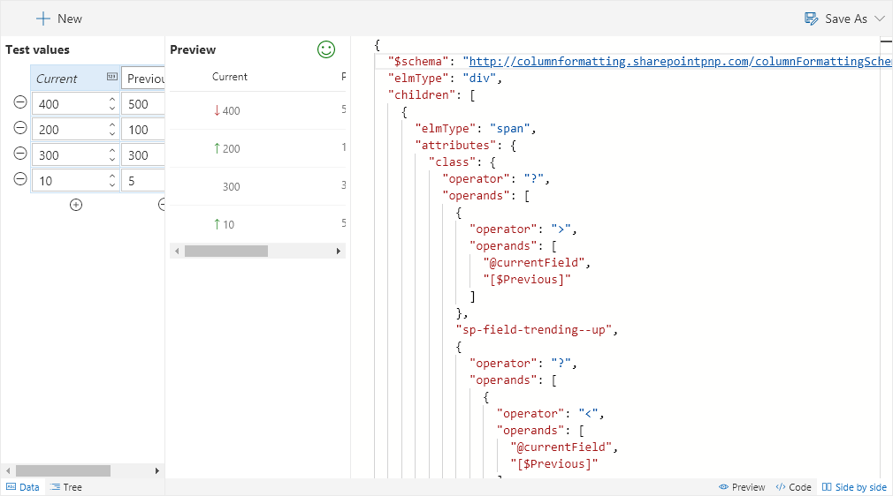

# # Trending

Compares other fields in the row to provide an icon based on trending values.

## How this template works

The # Trending template makes use of column formatting's ability to reference other fields in the same row. In this case the value in the _Previous_ column (`"[$Previous]"`) is compared against the value in the _Current_ column (`"@currentField"`). Based on this comparison either a [special column formatting class](https://docs.microsoft.com/en-us/sharepoint/dev/declarative-customization/column-formatting#predefined-classes) is applied or some inline styles:

|Condition|Class|Icon|Style|
|---|---|---|---|
|Current **>** Previous|sp-field-trending--up|SortUp|padding-left:0|
|Current **<** Previous|sp-field-trending--down|SortDown|padding-left:0|
|Current **=** Previous|||padding-left:12px|

The classes provide coloring that is applied to the icon to indicate the trend. When the values are equal no icon is shown and padding is added to keep the values aligned.

> This template is based on the [number-trending-icon](https://github.com/SharePoint/sp-dev-column-formatting/tree/master/samples/number-trending-icon) sample

## Supported column types
- Number

## Icon

> [Wizards](./index.md)

> Go [Home](../index.md)

